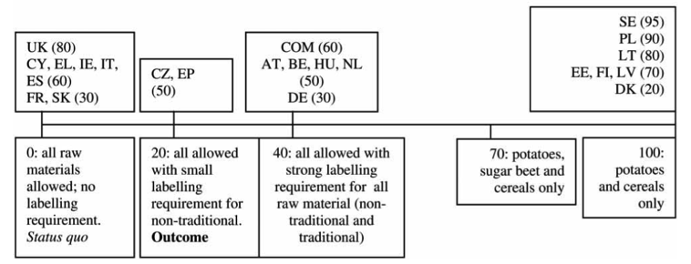

```{r setup, include=FALSE}
knitr::opts_chunk$set(echo = TRUE, warning=FALSE)

# Set directory
getwd()
setwd("/Users/knalewajko/Documents/HSoG/03 Drittes Semester/01 Data Mgmnt with R/FDA")

# Load packages
library(tidyverse)
library(dplyr)
library(tidyr)
library(readxl)
library(openxlsx)
library(knitr)
library(ggplot2)
library(gmodels)
library(lmtest)
library(multiwayvcov)
library(ggthemes)
library(extrafont)
library(stargazer)
library(plotly)
```

## I. Introduction

Who "wins" and who "loses" in European Union politics? This question has inspired a plethora of academic studies on determinants of bargaining success in the main EU institutions (Commission, Parliament, Council and European Council), while also sparking public debate.

In this short analysis I will focus on determinants of bargaining success in the intergovernmental Council of the European Union. The Council brings together national representatives of EU member states and thus allows to identify which member states are more successful than others, and why.
My specific focus will be on the role of eurozone membership. To illustrate the research problem, consider what Poland's former foreign minister Radek Sikorski once said about his country's membership in the common currency:

> *"As Minister of Foreign Affairs I would like to share with you my political judgment on the question if joining the eurozone will make our country's position stronger or weaker. I think that this is a situation captured well by the following American proverb: **'if you are not at the table, you are on the menu'**".*[^1]

In other words, he suggests that Poland's adoption of the common currency would make the country more influential in European politics. This paper will explore how much empirical substance such a claim has. Are Euro members really more influential?

In sum I will address the following research question: **How does eurozone membership impact bargaining success in the Council?**


## II. Theory and hypotheses

**My main hypothesis concerns the impact of eurozone membership** on bargaining success in the Council.

As @adler2014 notes in the most comprehensive work on the topic to date, British and Danish negotiators are stigmatized because of their countries' non-membership in the common currency. They lose status among their peers in the Council. They have to wait outside of the room when Euro members take decisions in exclusive decision-making bodies such as the Eurogroup. They are presented with legislation pre-agreed by Euro members.

We thus assume the following:

&nbsp;&nbsp;&nbsp;&nbsp;&nbsp;&nbsp;*H1: eurozone members achieve higher levels of bargaining success.*

Besides this main hypothesis I will explore **a range of other variables** which were identified in the literature to have an impact on bargaining success. These variables will serve as **control** in order to isolate the effect of eurozone membership from other explanations of bargaining outcomes.

**Holding the Council presidency** was identified across studies as a robust predictor of improved negotiation performance [@schalk2007; @thomson2008]. Presidents control the agenda, the timetable and the shape of coalitions in the Council and can influence those parameters in their favour.

&nbsp;&nbsp;&nbsp;&nbsp;&nbsp;&nbsp;*H2: Countries holding the presidency are more successful in the Council.*

The significance of **being a net contributor** to the EU budget for decision-making in the Council was identified in several studies based on the DEU data set [@zimmer2005] and voting records in redistributive policy areas [@bailer2004], while being refuted by @golub2012. In essence, the claim is that net contributors "largely mount the bill for the integration project"" [@golub2012, 4] and in return receive accommodation during negotiations.

&nbsp;&nbsp;&nbsp;&nbsp;&nbsp;&nbsp;*H3: Net contributors to the EU budget have more bargaining success.*

**New member states** which joined the EU in and after 2004 should have lower chances to perform well in the Council. As @bailer2004 shows, they accumulated less network capital than older member states and are thus less able to construct coalitions. Additionally, representatives of new member states display lower levels of bargaining skills, a natural phenomenon given their short tenure in EU negotiations. 

&nbsp;&nbsp;&nbsp;&nbsp;&nbsp;&nbsp;*H4: New member states have less bargaining success.*

**Voting power** is a factor which affects the likelihood of building a majority in the Council [@thomson2011]. Other things being equal, a member state with more voting power will be more often pivotal for transforming a "losing"" into a "winning" coalition.

&nbsp;&nbsp;&nbsp;&nbsp;&nbsp;&nbsp;*H5: Member states with more voting power have more bargaining success.*

**Salience** has been identified across studies as one of the most important determinants of bargaining success in the Council. A member state for whom a proposal is highly salient, for instance because "losing" would frustrate the domestic electorate, will invest more political capital into achieving a favorable result [@bailer2004; @thomson2011; @veen2011].

&nbsp;&nbsp;&nbsp;&nbsp;&nbsp;&nbsp;*H6: Higher levels of salience imply more bargaining success.*

**Member state size** is an intuitive factor of bargaining success, although the relation between size and negotiation performance is controversial. While some scholars establish a link between being large and powerful, be it due to better outside options , lower reputation constraints or material capabilities [@moravcsik1998; @bailer2004], others argue in the opposite direction [e.g. @golub2012]. Without delving into this debate, I will include in the model **population size** as a proxy for member state size.

&nbsp;&nbsp;&nbsp;&nbsp;&nbsp;&nbsp;*H7: The larger a member state's population the bigger the bargaining success.*

Another hypothesis concerns **how far a member state's position is from the European Commission**. The Commission plays a very important role in Council negotiations [@bailer2004; @thomson2011; @veen2011]. As the agenda-setter, it has much leeway in deciding which positions and which issues a proposal should include, and as de-facto co-legislator with some veto power the Commission closely monitors Council negotiations. Thus, we can hypothesize that when a member state has a position close to the Commission, it gets a powerful ally, which might translate positively into the level of bargaining success.

&nbsp;&nbsp;&nbsp;&nbsp;&nbsp;&nbsp;*H8: The smaller the distance on policy positions between a member state and the Commission, the bigger the bargaining success.*

Finally I will include two **ideological variables**. Bargaining success in the Council might be influenced by **ideological (dis)alignment between governments of the member state and the presidency**. More alignment implies a higher coherence of policy positions between the two actors, and thus a higher probability of inclusion. This assumption is supported by extant studies on Council negotiations which suggest that a left-oriented Council before enlargement favored left-leaning governments [@mattila2004], while the opposite (a right-oriented Council more inclusive towards similarly oriented governments) was found for some post-enlargement periods [@hosli2011].

Specifically, I will include two dimensions: on the left-right scale and the EU position scale, *i.e.* whether a member state favors more or less European integration. I measure the distance between a member state and the Council presidency, to account for the extraordinarily importance of the presidency as "formateur" of Council coalitions.

&nbsp;&nbsp;&nbsp;&nbsp;&nbsp;&nbsp;*H9: The smaller the distance on the left-right scale between a member state and the presidency, the bigger the bargaining success.*

&nbsp;&nbsp;&nbsp;&nbsp;&nbsp;&nbsp;*H10: The smaller the distance on the independence-integration scale between a member state and the presidency, the bigger the bargaining success.*


## III. Data and research method

In my analysis I will use DEU II data set [@thomson2012] as source for the response variable. Predictor variables will include independent and control variables necessary for the estimation of aforementioned hypotheses. 

#### EU Decision-making data base

The data set contains information on 125 controversial legislative proposals introduced in the Council between 1995 and 2009 [@thomson2012]. Out of those, 69 proposals were introduced before and 56 after EU's enlargement in 2004.

Every proposal was split into issues which triggered the strongest controversies during negotiations. For each issue, researchers recorded:

*	The **initial position** an actor took at the outset of negotiations (i.e. directly after the Commission introduced the proposal) 
*	The level of **salience** attached by the actor to the negotiated issue
*	The final **outcome** of the negotiations

This information was plotted on a uni-dimensional policy scale ranging from 0 to 100, thereby allowing to operationalize bargaining success as the distance between an actor's initial position and the final outcome of negotiations: the closer this distance, the bigger the success. Please refer to *Figure 1* for illustration (parentheses show salience scores) [@arregui2009].



#### Additional variables gathered by the author

The operationalization of the independent variables is straightforward. Eurozone membership (*H1*) is captured by a dummy variable indicating if the country in question was a eurozone member in a given year. The Council presidency (*H2*) is indicated by a dummy capturing if the country holds the presidency in the given year. Also net contributor status in a given year (*H3*) is coded as a dummy, on the basis of Financial Reports of the European Commission, as well as being a "new" member state (*H4*). Voting power (*H5*) is identified by the Banzhaf score applicable to the year of the negotiation. Salience levels (*H6*) are taken from the DEU data set while population size (*H7*) from Eurostat; it is indicated in millions. Finally, the distance of a member state's position to the Commission (*H8*) is calculated from the DEU data set, and data on left-right positions (*H9*) and EU orientations (*H10*) of governments were compiled by Christopher @wratil2017 and generously made available to the author. The indicators capture a seat-weighted average for government parties based on the Comparative Manifesto Project [@volkens2015].

Below in *Table 1* the dependent variables as well as the main independent variables have been listed.[^2]

```{r fig.cap=paste("Table 1. Dependent and main independent variables"), echo=FALSE}
# Create the codebook
variables <- c('isnr','year','country','position','salience','pec','pep','out','disec','disep','success','salsucc','lsalsucc','ea','presidency','newms','netcontr','votepower','population','iidiscoun','liidiscoun','lrdiscoun')
description <- c('Unique IDs of negotiated issues (chr)','Negotiation year (num: 1995-2009)','Country code (chr)','Initial position of each country on a given issue (num: 0-100)','Salience score of each issue for the given country (num: 0-100)','Position of the European Commission on a given issue (num: 0-100)','Position of the European Parliament on a given issue (num: 0-100)', 'Final outcome of the given negotiation (num: 0-100)','Absolute distance between member state and European Commission on each issue (num: 0-100)','Absolute distance between member state and European Parliament on each issue (num: 0-100)','Measure of negotiation success which computes the distance between the initial position and the outcome of each negotiation, translated into positive values for ease of interpretation (num: 0-100)','Saliency-weighted success score (num: 0-100)','Natural log of the saliency-weighted success score (num: 0-4.6)','Dummy for eurozone membership (log: TRUE/FALSE)','Dummy for holding Council presidency (log: TRUE/FALSE)','Dummy for new member state of the EU (log: TRUE/FALSE)','Dummy for net contributor to EU budget (log: TRUE/FALSE)','Voting power in the European Council (num: 0.94-11.16)','Population size (num: 0.4-86 M)','Absolute distance on orientation towards EU integration between each member state and the Council President; calculated on the basis of Chapel Hill Expert Survey Data (CHES) (num: 0-3)','Log of the EU integration distance (num: 0-1.36)','Absolute distance on left-right ideological position scale between each member state and the Council President; calculated on the basis of CHES (num: 0-2.5)')
codebookFULL <- data.frame(variables, description)
codebookSHORT <- codebookFULL
codebookSHORT <- codebookSHORT[-c(1:3,7,10,13,21), ]
knitr::kable(codebookSHORT, row.names = FALSE, col.names = c("Variable","Description"), caption = "Short codebook listing main variables") # Output the table
```

## IV. Preparation of data set for analysis

### Data cleaning

In order to prepare a complete data set which would be suitable for analysing the mentioned hypotheses, I "cleaned" my data in three steps.

Firstly, in its original form, the DEU II data set [@thomson2012] is "untidy," since its column names consist of values. I therefore needed to make sure that each variable formed a column, each observation a row, and that the observational units - a table. This step was necessary in order to ensure data compatibility with statistical software 'R' and the necessary packages. Thus I used *dplyr* and *tidyr* packages to make the data set is narrower and longer. In the end I merged the resulting data frame together with the variables that had been left off during this process.

```{r echo=FALSE}
# 01. PREPARE DATA SET FOR ANALYSIS

# Load data
db <- read.csv("deuII.csv")
codebook <- read.csv("Codebook_DEUII.csv")

# Broad to long: Countries & Position (per issue "isnrnmc" or "isnr")
tidy1 <- db %>% 
  dplyr::select(isnr, pat:puk) %>% 
  tidyr::gather(., country, position, -isnr)

# Broad to long: Countries & Salience (per issue "isnrnmc" or "isnr")
tidy2 <- db %>% 
  dplyr::select(isnr, sat:suk) %>% 
  tidyr::gather(., country2, salience, -isnr)

# Merge the Two
tidy2$isnr <- NULL
tidy2$country2 <- NULL
db2 <- cbind(tidy1, tidy2)

# Correct country name
db2 <- db2 %>% 
  tidyr::separate(country, into = c("p", "country"), sep = 1)
db2$p <- NULL

# Add other control independent variables by the unique "isnr"
db2$pec <- db$pcom[match(db2$isnr, db$isnr)]
db2$pep <- db$pep[match(db2$isnr, db$isnr)]
db2$prnr <- db$prnr[match(db2$isnr, db$isnr)]
db2$out <- db$out[match(db2$isnr, db$isnr)]

# Order database
db2 <- db2[c(7,1,2,3,4,5,6,8)]

# Add "year" variable to the dataset be able to merge it with the one with independent variables (that I created by myself before)
db2 <- db2 %>%
  tidyr::separate(prnr, into = c("d", "nr"), sep = 1) %>% 
  tidyr::separate(nr, into = c("year", "e"), sep = 2)
db2$d <- NULL
db2$e <- NULL
```

Secondly, I merged the resulting data frame with the aforementioned independent variables (by variables *country* and *year*) that I had gathered myself.[^3]

```{r echo=FALSE}
# Add other independent variables
db3 <- readxl::read_excel("Dataset2_27112017.xlsx", sheet = 1)
db3 <- db3 %>%
  tidyr::separate(year, into = c("a", "year"), sep = 2)
db3$a <- NULL
FULL <- left_join(db2, db3, by = c("country","year"))
FULL$New_MS <- NULL
```

Thirdly, I created a number of additional variables such as the measure of coalition with the European Commission and European Parliament, and the measures of negotiation success (all in absolute values).[^4]

```{r echo=FALSE}
# Create additional variables for later analysis
FULL <- FULL %>% 
  mutate(disec = pec - position) %>%  # coalition with the EC
  mutate(disep = pep - position) # coalition with the EP
FULL$disec <- abs(FULL$disec) # convert to absolute values
FULL$disep <- abs(FULL$disep) # convert to absolute values

# Create a measure of bargaining success
FULL <- FULL %>% 
  mutate(success = out - position)  #  measure of success
FULL$success <- abs(FULL$success) # convert to absolute
FULL$success <- FULL$success-100  # Recoding the value, so that the bigger it is, the more success it shows, for the sake of easiness of interpretation
FULL$success <- abs(FULL$success)
FULL <- FULL %>%
  mutate(salsucc = success * salience / 100)

# Reorder database
FULL <- FULL[c(2,1,3,4,5,6,7,8,17,18,19,20,9,10,15,16,13,14,11,12)]

# Save tidy data
openxlsx::write.xlsx(FULL, 'DEU+.xlsx')
```

### Data diagnostics

In order to check whether I can employ ordinary least squares (OLS) models to conduct inferential analysis on this data set, I have checked all variables of interest for distribution normality, outliers and homoscedasticity. Many variables have turned out to be multinomially distributed, and one of the dependent variables was right-skewed. I have therefore decided to log the right-skewed saliency-weighted variable and employ OLS models with robust standard errors for estimation of both types of models. Even though there has turned to be a slight multicollinearity between independent variables *voting power* and *population* (VIF of approx. 4 on both of them), I have decided to use them together in my estimations, since the correlation was not exceptionally high and given a limited space of this paper. This multicollinearity was not surprising, given that the voting powers in the Council are indeed calculated in part based on each country's population size. [^5]


## V. Descriptive analysis

Two distinct dependent variables will be used as measures of bargaining success. One of them is the simple measure of the absolute distance between a country's position and the bargaining outcome:
$$
\begin{aligned}
  \ Bargaining\ success_{ic} = ||Position_{ic} - Outcome| - 100| \\
\end{aligned}
$$
in which the bargaining success of country *c* on issue *i* is the absolute distance between that country's position *Position_{ic}* and the final outcome, translated into increasing values.

The other measure of success is a saliency-weighted measure. It is meant to account for the country's changing utility function, as discussed in previous literature [@arregui2009; @golub2012; @cross2013]. The intuition behind this is that, because a country values each issue differently, equal departures from their ideal point have different impacts on that country's utility. The other dependent variable is therefore calculated in the following way:
$$
\begin{aligned}
  \ Bargaining\ success_{ic} = \frac {||Position_{ic} - Outcome| - 100|\ *\ Salience_{ic}} {100} \\
\end{aligned}
$$
in which that same absolute distance, multiplied by the saliency that country attaches to their position, *Salience_{ic}*. The number is then divided by *100* in order to keep it within 1-100 range.

Before proceeding to the inferential analysis, I have attempted to uncover and better understand existing patterns in the data.

Firstly, I have examined the two dependent variables of interest (see below). Namely, I have plotted mean bargaining success of each member state, simple and saliency-weighted, by "New Member State" category to check whether their distributions will be different and change the interpretation of the data.

```{r, echo=FALSE, warning=FALSE, message=FALSE}
# Load tidy data
db <- readxl::read_excel("DEU+.xlsx", sheet = 1)

# Ensure all variables are correctly read by R
db$year <- as.numeric(db$year)

country_success <- db %>% 
  group_by(country, newms) %>% 
  summarise(mean_success = mean(success, na.rm = TRUE)) %>% 
  arrange(desc(mean_success))
country_success <- country_success[complete.cases(country_success),]
country_success$newms <- as.character(country_success$newms)

plot1 <- country_success %>% 
  ggplot() + 
  geom_point(aes(x = mean_success, reorder(country, mean_success), color = newms)) +
  geom_vline(aes(xintercept = mean(mean_success))) +
  labs(x = "Unweighted bargaining success",
       y = "EU member state",
       color = "NMS",
       title = "Simple mean negotiation success in the Council per each EU member state",
       subtitle = "Data points are mean distances between negotiation outcomes and initial positions",
       caption = "Source: DEU II (1995-2009).") +
  theme_bw() +
        theme(legend.position = "bottom", 
              legend.direction = "horizontal",
              legend.box = "horizontal",
              axis.line = element_line(size=1, colour = "black"),
              panel.grid.major = element_line(colour = "#d3d3d3"),
              panel.grid.minor = element_blank(),
              panel.border = element_blank(), panel.background = element_blank(),
              plot.title = element_text(size = 10, family = "Tahoma", face = "bold"),
              text=element_text(family="Tahoma"),
              axis.text.x=element_text(colour="black", size = 6),
              axis.text.y=element_text(colour="black", size = 6))

country_success2 <- db %>% 
  group_by(country, newms) %>% 
  summarise(mean_success2 = mean(salsucc, na.rm = TRUE)) %>% 
  arrange(desc(mean_success2))
country_success2 <- country_success2[complete.cases(country_success2),]
country_success2$newms <- as.character(country_success2$newms)

plot2 <- country_success2 %>% 
  ggplot() + 
  geom_point(aes(x = mean_success2, reorder(country, mean_success2), color = newms)) +
  geom_vline(aes(xintercept = mean(mean_success2))) +
  labs(x = "Saliency-weighted bargaining success",
       y = "EU member state",
       color = "NMS",
       title = "Saliency-weighted mean negotiation success in the Council per EU member state",
       subtitle = "Data points are transformed mean distances between negotiation outcomes and initial positions",
       caption = "Source: DEU II (1995-2009).") +
  theme_bw() +
        theme(legend.position = "bottom", 
              legend.direction = "horizontal",
              legend.box = "horizontal",
              axis.line = element_line(size=1, colour = "black"),
              panel.grid.major = element_line(colour = "#d3d3d3"),
              panel.grid.minor = element_blank(),
              panel.border = element_blank(), panel.background = element_blank(),
              plot.title = element_text(size = 10, family = "Tahoma", face = "bold"),
              text=element_text(family="Tahoma"),
              axis.text.x=element_text(colour="black", size = 6),
              axis.text.y=element_text(colour="black", size = 6))
plotly::ggplotly(plot1)
plotly::ggplotly(plot2)
```

Interestingly, the saliency-weighted variable shows a pattern between the bargaining success and the length of a member state's membership in the EU community. This finding would go in line with *H4* and should therefore be further explored in the later regressions.

Secondly, I have been interested to find out whether the holders of Council Presidency have been in the past more prone to be successful in negotiations (see below).

```{r, echo=FALSE, warning=FALSE}
db$presidency <- as.logical(db$presidency)
plot3 <- ggplot(data=subset(db, !is.na(presidency)), aes(x = presidency, y = salsucc)) + 
  geom_boxplot() +
  labs(x = "Council presidency holder at the time of negotiation",
       y = "Saliency-weighted bargaining success",
       title = "Saliency-weighted negotiation success in the Council per presidency holder",
       subtitle = "Data points are transformed mean distances between negotiation outcomes and country's initial positions",
       caption = "Source: DEU II (1995-2009).") +
  theme_bw() +
        theme(legend.position = "bottom", 
              legend.direction = "horizontal",
              legend.box = "horizontal",
              axis.line = element_line(size=1, colour = "black"),
              panel.grid.major = element_line(colour = "#d3d3d3"),
              panel.grid.minor = element_blank(),
              panel.border = element_blank(), panel.background = element_blank(),
              plot.title = element_text(size = 10, family = "Tahoma", face = "bold"),
              text=element_text(family="Tahoma"),
              axis.text.x=element_text(colour="black", size = 6),
              axis.text.y=element_text(colour="black", size = 6))
plotly::ggplotly(plot3)
```

The data seems to give a limited evidence for that claim. As visible in the *Figure 2* above, the mean saliency-weighted bargaining success is only slightly higher for the Council Presidency holders.

The last set of my descriptive analysis concerned my main variable of interest, *i.e.* eurozone membership (see below). I wanted to find out whether EU countries that are also members of euro area have had more bargaining success.

```{r, echo=FALSE, warning=FALSE}
plot4 <- ggplot() +
  geom_density(data=subset(db, ea == 0), mapping = aes(salsucc), fill = "grey", color = "grey", alpha = 0.6) +
  geom_density(data=subset(db, ea == 1), mapping = aes(salsucc), fill = "gold", color = "gold", alpha = 0.4) +
  labs(x = "Saliency-weighted negotiation success in the Council",
       y = "Count of negotiations",
       title = "Saliency-weighted negotiation success in the Council per eurozone membership",
       caption = "Source: DEU II (1995-2009).") +
  theme_bw() +
        theme(legend.position = "bottom", 
              legend.direction = "horizontal",
              legend.box = "horizontal",
              axis.line = element_line(size=1, colour = "black"),
              panel.grid.major = element_line(colour = "#d3d3d3"),
              panel.grid.minor = element_blank(),
              panel.border = element_blank(), panel.background = element_blank(),
              plot.title = element_text(size = 10, family = "Tahoma", face = "bold"),
              text=element_text(family="Tahoma"),
              axis.text.x=element_text(colour="black", size = 6),
              axis.text.y=element_text(colour="black", size = 6))
plotly::ggplotly(plot4)
```
```{r, include=FALSE}
db %>% 
  dplyr::filter(ea == 1) %>%
  summarize(median = median(salsucc, na.rm = TRUE))

db %>% 
  dplyr::filter(ea == 0) %>%
  summarize(median = median(salsucc, na.rm = TRUE))
```

The data seems to somewhat confirm this assumption. The density plot of non-eurozone member states (left-hand silver density plot) becomes steep already at the value of "10," while that of eurozone-members (right-hand gold density plot) grows until it reaches the value of "50." The majority of data concerning the eurozone-members is clustered in the range of 25 to 60, while that of non-eurozone members, between 5 and 40. The median value of negotiating success for eurozone members is also higher than that of the non-eurozone members (36 vs. 30). Nevertheless, these findings need further confirmation.


## VI. Inferential analysis

As indicated above, I have decided to employ two model families for the estimation of the impact of eurozone membership on the negotiation success in the Council. One is modelled on an unweighted measure of bargaining success (Models 1 and 2 below), while the other concerns saliency-weighted measure of bargaining success as my dependent variables (Models 3 and 4 below). In contrast to the unweighted measure of bargaining success, the saliency-weighted measure of bargaining success was right-skewed. I have therefore taken a natural log of its values before using it for estimations.

I have then employed OLS estimations with robust standard errors to correct for aforementioned heteroscedasticity (Models 2 and 4 below) and decided to run two additional models with country fixed-effects to correct for possible omitted variable bias and further isolate the unique effect of the independent variables.

```{r, echo=FALSE}
db$ea <- as.numeric(db$ea)
db$presidency <- as.numeric(db$presidency)
db <- db %>% 
  mutate(liidiscoun = log(1+iidiscoun))  # I have added 1 to make sure there are no negative values

# Model 1: unweighted measure of bargaining success OLS
reg1 <- lm(success ~ ea + presidency + netcontr + newms + salience + disec + lrdiscoun + liidiscoun + votepower + population, data = db)

cov.reg1 <- sandwich::vcovHC(reg1, type = "HC") # Robust standard errors
rob.std.err1 <- sqrt(diag(cov.reg1))
naive.std.err1 <- summary(reg1)$coefficients[,2]

# Model 2: OLS on saliency-weighted measure of bargaining success with a lognormal distribution
db <- db %>% 
  mutate(lsalsucc = log(1+salsucc)) # I have added 1 to make sure there are no negative values
reg2 <- lm(lsalsucc ~ ea + presidency + netcontr + newms + disec + lrdiscoun + liidiscoun + votepower + population, data = db)

cov.reg2 <- sandwich::vcovHC(reg2, type = "HC") # Robust standard errors
rob.std.err2 <- sqrt(diag(cov.reg2))
naive.std.err2 <- summary(reg2)$coefficients[,2]

# Model 3: OLS on unweighted measure of bargaining success with country fixed effects
reg3 <- lm(success ~ ea + presidency + netcontr + newms + salience + disec + lrdiscoun + liidiscoun + votepower + population + country, data = db)

cov.reg3 <- sandwich::vcovHC(reg3, type = "HC") # Robust standard errors
rob.std.err3 <- sqrt(diag(cov.reg3))
naive.std.err3 <- summary(reg3)$coefficients[,2]

# Model 4: OLS on unweighted measure of bargaining success with country fixed effects
reg4 <- lm(lsalsucc ~ ea + presidency + netcontr + newms + disec + lrdiscoun + liidiscoun + votepower + population + country, data = db)

cov.reg4 <- sandwich::vcovHC(reg4, type = "HC") # Robust standard errors
rob.std.err4 <- sqrt(diag(cov.reg4))
naive.std.err4 <- summary(reg4)$coefficients[,2]
```

```{r reg, echo = FALSE, warning = FALSE, results = "asis"}
library(stargazer, quietly = TRUE)
stargazer(list(reg1,reg1,reg3,reg3,reg2,reg2,reg4,reg4),
          se = list(naive.std.err1,rob.std.err1,naive.std.err3,rob.std.err3,naive.std.err2,rob.std.err2,naive.std.err4,rob.std.err4),
          column.labels=c("default","robust","default","robust","default","robust","default","robust"),
          title="Regression Results",
          model.numbers=TRUE,
          dep.var.labels=c("Bargaining Success","Log(Saliency-Weighted)"),
          covariate.labels=c("Eurozone Member", "Presidency", "Net Contributor", "New MS", "Salience", "Distance from EC", "Left-Right Distance", "Log(Indep-Integr Distance)", "Voting Power", "Population"),  
          omit.stat=c("LL","ser","f"),
          type="html")
```

To assure that the resulting estimators are unbiased, the models have been checked against the Gauss-Markov assumptions (linearity, mean independence, homoscedasticity, uncorrelated disturbances, and normal disturbances). The regression diagnostics included residual plots, added-variable plots, outlier checks with QQ-plots, Bonferonni tests, high leverage points, and influence plots. I have also tested the independent variables for multicollinearity and - as indicated above - employed robust standard errors to correct for heteroscedasticity of the data.[^6] The diagnostics confirmed that there are no patterns that could significantly bias the regressions' estimators.

All models include approx. 3,800 observations, which means that approx. as many as 5000 have been dropped. This is due most probably to missing values in our main independent variable of interest, *Eurozone membership*. Independently of the assumed heteroscedasticity in the date, the even models (no. 2 and 4 with robust standard errors) did not significantly changed the statistical significance of the coefficients.[^7] The R2 values are very low indicating overall poor model fits. The first two models seem to explain a little more variance in the dependent variable than the other two (approx. 5 vs. 1.5 percent variance).

Overall, the results confirm the hypotheses regarding the negative effect of increasing distance between the member states and the EC on the negotiation success (*H8*), the negative impact of being new in the EU (*H4*), and the positive relation between the voting power and the negotiation success (*H5*). Interestingly enough, they contradict however the hypothesis about the positive correlation of issue saliency on the negotiation success (*H6*). However, the substantive significance of this finding is very low, as it seems to indicate that one change on the issue salience, decreases the negotiation success only by approx. 0.04.

Regarding our main variable of interest, *Eurozone membership*, it seems that its effects could be negative, unlike what is often claimed in public debates. The models that confirm it are the saliency-weighted ones (Models 3 and 4). They confirm that a one-unit increase on *Eurozone membership* scale (*i.e.* becoming member of eurozone) results in 14-35.1 percentage change in the bargaining success. It is important to highlight, that the higher results that comes from the country fixed-effects model, suggests that this significant change relates specifically to Slovakia that joined the eurozone in 2009, *i.e.* in the time frame included in the data set.

Holding all estimated variables at their medians, below are predictions for the negotiation success, depending on whether the country belongs to the eurozone or not. This result goes against the common belief that being part of the common currency area gives a country more clout. It indicates in fact that a country that is a member of eurozone has a negative 14 percent change in the bargaining success, or in other words, if we hold all other variables constant, its predicted success will reach the exponented value indicated on the graph, which is smaller than that for the non-eurozone member states (*i.e.* 23.7 for eurozone-members vs. 27.2 for non-eurozone members).

```{r, include=FALSE}
exp(3.304236) # non-ez predicted coefficient
exp(3.164251) # predicted coefficient for the ez
```

```{r, echo=FALSE, warning=FALSE}
df <- data.frame(ea = c(0,1), 
                 presidency = median(db$presidency, na.rm = TRUE), 
                 netcontr = median(db$netcontr, na.rm = TRUE), 
                 newms = median(db$newms, na.rm = TRUE),
                 salience = median(db$salience, na.rm = TRUE),
                 disec = median(db$disec, na.rm = TRUE),
                 lrdiscoun = median(db$lrdiscoun, na.rm = TRUE),
                 liidiscoun = median(db$liidiscoun, na.rm = TRUE),
                 votepower = median(db$votepower, na.rm = TRUE),
                 population = median(db$population, na.rm = TRUE))
df$prediction <- predict(reg2, newdata = df, type = 'response')
plot5 <- df %>% 
  ggplot(mapping = aes(x = ea, y = prediction)) +
  geom_point(size = 7, color = c("grey","gold")) + 
  scale_color_manual(values = colors) +
  scale_x_discrete(name="Eurozone membership", limits=c(0, 1)) +
  scale_y_continuous(name="Prediction of success") +
  labs(title = "Prediction of saliency-weighted bargaining success by eurozone membership",
       subtitle = "Data points refer to OLS Model 3",
       caption = "Source: DEU II (1995-2009).") +
  theme_bw() +
        theme(axis.line = element_line(size=1, colour = "black"),
              panel.grid.major = element_line(colour = "#d3d3d3"),
              panel.grid.minor = element_blank(),
              panel.border = element_blank(), panel.background = element_blank(),
              plot.title = element_text(size = 10, family = "Tahoma", face = "bold"),
              text=element_text(family="Tahoma"),
              axis.text.x=element_text(colour="black", size = 6),
              axis.text.y=element_text(colour="black", size = 6))
plotly::ggplotly(plot5)
```

## VII. Conclusion

In this paper I have tried to assess the impact of eurozone membership on the negotiation success in the Council of the European Union. For that, I have used the well-known DEU II data set, which I had complemented with additional independent variables to control for possible omitted variable bias.

Due to thorough theoretical motivation of independent variables choice, I had expected the variables to explain significant amount of variance in the measure of negotiation success. However, the model fits of all estimated regressions turned out to be very low. Consequently, I was unable to univocally answer my main research question. However, two of the estimated models did confer statistically high significance to *Eurozone membership* variable. Contrary to the expectations, the uncovered correlation has turned out to be negative. Nevertheless, more analysis is necessary in order to ensure the reliability of these findings. One possible avenue for future research is to take into consideration the negotiation reports published by the EU Council presidencies on [Eur-Lex webiste](http://eur-lex.europa.eu/browse/institutions/eu-council.html), where all decisions taken by the Council's ministers have been recorded in a binary fashion and are therefore well-suited for logistic estimations.

## VIII. Annex

### Codebook

Below the codebook of the data set used for the analysis:

```{r echo=FALSE}
knitr::kable(codebookFULL) # Output the table
```

### Data diagnostics

Below all data diagnostics conducted before employing OLS regressions.

```{r echo=TRUE, warning=FALSE}
# Plot density plots to check for the normality of continuous variables' distribution and potential outliers
ggplot(db, aes(x = position)) +
  geom_density() # binomial distribution
ggplot(db, aes(x = salience)) +
  geom_density() # right-skewed
ggplot(db, aes(x = pec)) +
  geom_density() # left-skewed
ggplot(db, aes(x = pep)) +
  geom_density() # left-skewed
ggplot(db, aes(x = out)) +
  geom_density() # multinomial distribution
ggplot(db, aes(x = disec)) +
  geom_density() # binomial distribution
ggplot(db, aes(x = disep)) +
  geom_density() # binomial distribution
ggplot(db, aes(x = success)) +
  geom_density() # left-skewed
ggplot(db, aes(x = salsucc)) +
  geom_density() # right-skewed
ggplot(db, aes(x = iidiscoun)) +
  geom_density() # right-skewed
ggplot(db, aes(x = lrdiscoun)) +
  geom_density() # multinomial distribution

# Plot bar plots to check for the normality of discrete variables' distribution and whether there is enough variance
ggplot(db, aes(ea)) +
  geom_bar() # normal distribution
ggplot(db, aes(presidency)) +
  geom_bar() # significantly less values of "1"
ggplot(db, aes(newms)) +
  geom_bar() # less values of "1", but overall enough variance
ggplot(db, aes(netcontr)) +
  geom_bar() # normal distribution
```

### Regression diagnostics

Below all regression diagnostics conducted in order to ensure the reliability of the discussed estimators.

```{r echo=TRUE, warning=FALSE}
# MODELS 1 & 2
plot(reg1) # All diagnostics OK, especially if standard errors considered
plot(reg2) # All diagnostics OK, especially if standard errors considered
# Check for patterns in residuals
car::residualPlots(reg1) # no visible patterns, all residuals have mean=0 and variance=1
car::residualPlots(reg2) # no visible patterns, all residuals have mean=0 and variance=1 

# Added variable plots to check for influential variables
car::avPlots(reg1, id.n=2, id.cex=0.7) # no unwanted influential variables
car::avPlots(reg2, id.n=2, id.cex=0.7) # no unwanted influential variables

# Bonferonni test for outliers
car::outlierTest(reg1) # p-value of '8690' is 0.014103
car::outlierTest(reg2) # p-value of '8855' is 0.01496

# High leverage points
car::influenceIndexPlot(reg1, id.n=3) # no observation is an outlier and simultaneously influential, therefore there is no need to remove any observation from the data set
car::influenceIndexPlot(reg2, id.n=3) # no observation is an outlier and simultaneously influential, therefore there is no need to remove any observation from the data set

# Testing for normality
car::qqPlot(reg1) # the distribution is slightly S-shaped, but overall normal
car::qqPlot(reg2) # the distribution is slightly S-shaped, but overall normal

# Testing for heteroscedasticity using Breush/Pagan and Cook/Weisberg score test for non-constant error variance
car::ncvTest(reg1) # The null hypothesis is that residuals are homoskedastic. I fail to reject the null, so the residuals are homogeneous, there is no constant variance.
car::ncvTest(reg2) # same as above

# Testing for multicollinearity
# In the first models, when "votepower" & "population" were put together, two gvif>4 suggested collinearity on variables "votepower" and "population", which is what I had expected since the voting power of EU member states is calculated also on the basis of each country's population. Because of that I decided to make two models instead of one.
car::vif(reg1) 
car::vif(reg2)

# MODELS 3 & 4
plot(reg3) # All diagnostics OK, especially if standard errors considered
plot(reg4) # All diagnostics OK, especially if standard errors considered

# Check for patterns in residuals
car::residualPlots(reg3)
car::residualPlots(reg4)

# Added variable plots to check for influential variables
car::avPlots(reg3, id.n=2, id.cex=0.7)
car::avPlots(reg4, id.n=2, id.cex=0.7)

# Bonferonni test for outliers
car::outlierTest(reg3) # p-value of '8690' is 0.0042857
car::outlierTest(reg4) # p-value of '8855' is 0.0043723

# High leverage points
car::influenceIndexPlot(reg3, id.n=3)
car::influenceIndexPlot(reg4, id.n=3)

# Testing for normality
car::qqPlot(reg3)
car::qqPlot(reg4)

# Testing for heteroscedasticity using Breush/Pagan and Cook/Weisberg score test for non-constant error variance
car::ncvTest(reg3) # can't reject null
car::ncvTest(reg4) # can't reject null
```

### Complete regression

```{r, results='asis', echo = FALSE}
invisible(stargazer(reg1, reg1, reg2, reg2, reg3, reg3, reg4, reg4,
          se = list(naive.std.err1,rob.std.err1,naive.std.err2,rob.std.err2,naive.std.err3,rob.std.err3,naive.std.err4,rob.std.err4), 
          title="Regression Results", 
          column.sep.width = "5pt",
          align=TRUE, 
          dep.var.labels=c("Bargaining Success", "Log(Saliency-Weighted Bargaining Success)"), 
          covariate.labels=c("Eurozone Member", "Presidency", "Net Contributor", "New MS", "Salience", "Distance from EC", "Left-Right Distance", "Log(Indep-Integr Distance)", "Voting Power", "Population"),  
          no.space=TRUE, 
          omit.stat=c("LL","ser","f"),
          add.lines = TRUE,
          column.labels=c("1: Normal SE", "1: Robust SE", "2: Normal SE", "2: Robust SE", "3: Normal SE", "3: Robust SE", "4: Normal SE", "4: Robust SE"), 
          dep.var.caption="",
          model.numbers=FALSE,
          type = "html", 
          out = "reg.html"))
```


## IX. Bibliography

[^1]: Sikorski 2011, author's translation and highlight.
[^2]: For exact information about all variables used in the analysis please refer to Codebook in section *VIII. Annex*.
[^3]: For exact information about all variables used in the analysis please refer to Table 1, or Codebook in section *VIII. Annex*.
[^4]: For exact information about all variables used in the analysis please refer to Table 1, or Codebook in section *VIII. Annex*.
[^5]: For all conducted tests please refer to sub-chapter Data diagnostics in section *VIII. Annex*.
[^6]: For all conducted tests please refer to sub-chapter Regression diagnostics in section *VIII. Annex*.
[^7]: For stargazer output including all models please refer to sub-chapter Complete regression in section *VIII. Annex*.